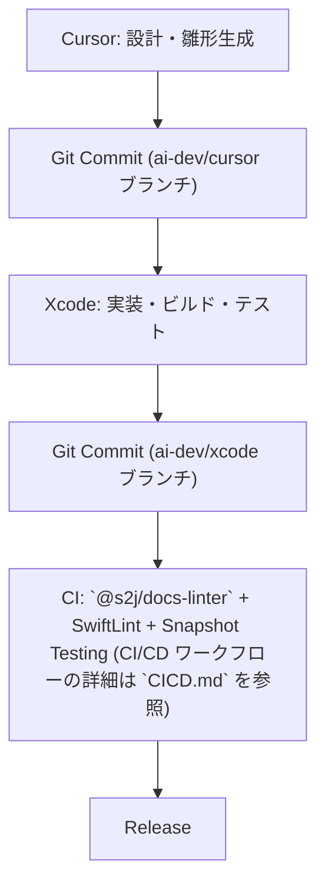

# Xcode Common Specs - 共通仕様

## 目的

* 本ドキュメントでは、本リポジトリ配下で開発する Swift / SwiftUI プロジェクトにおいて「AI 伴走開発」を行う際の共通仕様・ルールを定義する。
* 個別プロジェクトの仕様は、各リポジトリの `SPEC.md` に記載する。本ドキュメントと衝突する場合は、個別 `SPEC.md` が優先する。ただし設計方針 (FOP、I/O 境界、ドキュメント運用) は、本ドキュメントに合わせる。
* 関連する別紙:
  * [`KMP_PORTABILITY.md`](./KMP_PORTABILITY.md) — iOS / iPadOS の移植層
  * [`UX_VOCABULARY.md`](./UX_VOCABULARY.md) — 画面・操作・状態の語彙
  * [`UI_VIEWPORT.md`](./UI_VIEWPORT.md) — Viewport Integrity (到達性・安定)
  * [`TEST_RESULTS.md`](./TEST_RESULTS.md) — テスト結果のひな型
  * [`CICD.md`](./CICD.md) — CI/CD

## 適用範囲

* iOS / iPadOS のロジックは、Kotlin Multiplatform にポーティング容易な範囲に絞り、後日の移植を容易にする。最初から `commonMain` に置く戦略は採用しない。
* macOS アプリケーションは、Windows 11版への展開を考慮しない。macOS Human Interface Guidelines に寄せる。

| 対象 | 共有するもの | 共有しないもの |
| --- | --- | --- |
| iOS / iPadOS | ドメイン判断、データモデル、Repository 相当、キャッシュ方針、統計、バリデーション、画面・操作・状態の語彙 | SwiftUI 実装、UIKit、Observation / Combine、プラットフォーム I/O |
| iOS / iPadOS → Android | 上記の移植層。UI 語彙は iOS / iPadOS の体験を基準にする | ウィジェットの1対1対応。相手側に無い操作 (スワイプバック等) |
| macOS | FOP、Clean Architecture の部分借用、ドキュメント運用、自動テストの印 | Windows 11互換。iOS 向けナビゲーション語彙の強制。KMP 必須化 |

## 設計方針

### FOP (関数型オブジェクト指向プログラミング)

* ドメインの判断は、純関数にする。
* 受け渡すまとまりは、クラス階層ではなくイミュータブルなプレーンオブジェクト (`struct` / `enum`、`let`) にする。
* 継承や巨大なサービスオブジェクトは使わない。関数の合成で処理を組む。
* 副作用 (ネットワーク、ファイル I/O、Keychain、stdout / stderr、子プロセス) はアダプタに閉じる。

### GoF デザインパターン

* 仕様の検討段階などでは、共通語彙として GoF デザインパターンを使うことがある。
* 実装に、クラス階層や巨大なサービスオブジェクトを持ち込んではいけない。

### Clean Coding

* 関数は、小さく、名前で意図が読めるようにする。
* 関数は、1つにつき1責務とする。抽象度を混ぜない。
* エラーは、黙殺しない。契約は、「エラー処理」節に従う。
* コメントは、「なぜ」を書く。仕様の重複コピーは、仕様書側に置く。

### Clean Architecture の部分借用

* フルセットの Clean Architecture は、採用しない。
* ドメインを I/O から独立させる。
* 機能をユースケース関数として明示する (例: `LoadTimeline`、`ValidateForm`)。Presenter / Controller の機械的分割は、採用しない。SwiftUI の View を Controller に見立てた分割もしない。
* I/O をアダプタに寄せ、テストで差し替えやすくする。リポジトリ・インターフェースの量産は、採用しない。
* 依存は、内側 (domain) に向かわせる。DI コンテナ、フレームワーク非依存のための過剰なポートは、採用しない。
* プロトコルは、I/O 境界 (ネットワーク、ファイル、Keychain 等) の差し替えにだけ使う。ドメイン内部の protocol 量産は、しない。

### 画面構成 (MVU)

* View は、SwiftUI とする。Android 展開時の View は、Jetpack Compose UI とする。
* State は、イミュータブルな `struct` とする。
* Event (Intent) は、`enum` とする。
* 更新は、`(State, Event) -> State` の純関数とする。ドメイン判断は、ここに置く。
* ViewModel を置く場合は、I/O の起動と State の保持だけの薄い接着剤とする。判断を ViewModel に集めてはいけない。

## 技術スタック

* 言語: Swift (最新安定版)
* UI: SwiftUI (最優先)。Android 展開時は、Jetpack Compose UI
* プロジェクト管理: Xcode (`*.xcodeproj` or SwiftPM)
* 最低対応 OS: iOS v16 / iPadOS v16 / macOS v12
* 依存管理:
  * macOS / iOS / iPadOS: [Swift Package Manager (SPM)](https://docs.swift.org/swiftpm/documentation/packagemanagerdocs/)
  * Kotlin Multiplatform / Jetpack Compose UI: Gradle (Version Catalog を推奨)
  * ドキュメント検査: npm (`@s2j/docs-linter`)。アプリ実行時依存には使わない
  * PHP Composer は使わない
* テスト: Swift Testing (単体) + SnapshotTesting (UI コンポーネント)。UI 操作が必要な場合のみ XCTest

## 開発ルール

* 移植層 (ドメイン) は、同期の純関数を基本とする。非同期が必要でも、`Task` / `actor` は移植層に置かない。
* アダプタでは、Swift Concurrency (`async` / `await`、`actor`) を優先する。
* UIKit / AppKit の使用は、最小限に抑える。
* モジュール化 (Feature 単位で分割) を推奨する。
* Assets.xcassets にリソースを統合する。
* 定数・文字列は、Localizable.strings / .stringsdict を利用する。
* 実装修正の着手は、人間が許可してから実行する。

## マルチプラットフォーム

* iOS / iPadOS の移植層の許可 / 禁止 API は、[`KMP_PORTABILITY.md`](./KMP_PORTABILITY.md) を正とする。
* iOS / iPadOS と Android で揃える画面・操作・状態の語彙は、[`UX_VOCABULARY.md`](./UX_VOCABULARY.md) を正とする。macOS 固有の語彙は、同文書の macOS 表に分離する。
* UI 語彙は、体験の辞書であり、ウィジェットの1対1ではない。相手側に無い操作は、共有辞書から外す。

## プロジェクト構成

Android 展開時は、Gradle プロジェクトを別ツリー (または別リポジトリ) に置き、移植層だけを Kotlin に写します。
SwiftUI を共有してはいけません。

```
プロジェクト名/
├── LICENSE
├── README.md
├┬─ docs/  # 公開正本 (確定後)
│├─ archive/<initiative>/  # 確定時に旧 docs を freeze
│├─ `SPEC.md`
│└─ `SPEC_CICD.md`  # CI/CD Workflow ドキュメント (各プロジェクト固有。共通仕様は `CICD.md` を参照)
├┬─ docs_mod/  # 草案。テスト結果の集計も含む
│└─ `test-results.md`
├┬─ test/
│└─ `manual-tests.json`  # 実機 / Simulator / Terminal 確認のカタログ
├┬─ tools/
│└┬─ docs-linter  # Git サブモジュール『Docs Linter』
│　└┬─ dist/
│　　└─ `run-textlint.js`
├┬─ .github/
│└┬─ workflows/
│　├─ docs-linter.yml
│　└─ swift-test.yml  # CI/CD ワークフロー設定 (詳細は `CICD.md` を参照)
├┬─ scripts/  # スクリプト。exit code と stderr の契約はここに限る
│└─ test-local.sh  # ローカル・テスト実行スクリプト (統合版、汎用的)
├── アプリのエントリーポイント.swift
├── Package.swift  # Swift Package 定義 (プロジェクト・ファイル兼用の場合あり)
├── project.yml  # XcodeGen 設定ファイル
├── プロジェクト名.swift
├┬─ Sources/
│└┬─ プロジェクト名/  # メイン・ソースコード
│　├┬─ Domain/  # 移植層。純関数とイミュータブルな値
│　├┬─ Adapters/  # I/O。プロトコルはこの境界に限る
│　└┬─ Resources/  # リソースファイル
│　　├─ Images.xcassets
│　　├┬─ `Assets.xcassets`
│　　│└─ Contents.json
│　　├─ Base.lproj/Localizable.strings  # ローカライゼーション
│　　├─ en.lproj/Localizable.strings  # ローカライゼーション
│　　└─ ja.lproj/Localizable.strings  # ローカライゼーション
├┬─ Tests/
│└── プロジェクト名Tests/  # テストコード
├── UITests/
└── Preview Content/
```

## エラー処理

* ドメインは、エラーを黙殺しない。`Result` または型付きエラーで返す。`throw` する場合も、呼び出し側で必ず扱う。
* UI は、ユーザーに提示する (アラート、インラインエラー、空状態)。握りつぶしてはいけない。
* アプリの診断ログは、OSLog を使う。
* `scripts/` と CI だけが、exit code と stderr の契約を守る。GUI アプリ本体に exit code 契約を適用しない。

## 国際化・ローカライズ

* `Localizable.strings`, `Localizable.stringsdict` を必ず使用する。
  * Xcode v26.0以降では **Strings Catalog (.xcstrings)** が推奨。可能であれば 、`Localizable.xcstrings` を利用し、翻訳管理を効率化する。
* 翻訳キーは、コメント付きで管理する。
* Markdown 対応コメントを推奨する。

## コーディング規約

* [SwiftFormat](https://formulae.brew.sh/formula/swiftformat#default) でソースコードを自動整形すること。
* [SwiftLint](https://formulae.brew.sh/formula/swiftlint) でソースコードを検査すること。
* 1ファイル1型を原則とする。
* クラスより、`struct` / `enum` を優先する。
* 依存の差し替えは、I/O 境界のプロトコルに限る。

## デザイン規約

* iOS / iPadOS は、[Human Interface Guidelines](https://developer.apple.com/jp/design/human-interface-guidelines/) の iOS / iPadOS に準拠すること。Android 展開時の語彙基準も、この体験に合わせる。
* macOS は、[macOS Human Interface Guidelines](https://developer.apple.com/jp/design/human-interface-guidelines/) に準拠すること。iOS 向け制約を macOS に漏らしてはいけない。
* タイトル・テキストは、San Francisco フォントを使用する。
* UI 上に表示されたインタラクティブ要素は、必ずユーザーの標準的な操作によって到達・操作できる。詳細は [`UI_VIEWPORT.md`](./UI_VIEWPORT.md) を正とする。

### UI 設計原則 (Viewport Integrity)

| 原則 | 要件 |
| --- | --- |
| Reachability | 表示されている UI 要素は、ユーザーが必ず到達できる |
| Layout Stability | 表示された UI 要素が、起動・回転・サイズ変更によって予期せず移動しない |
| Content Integrity | 操作対象のコンテンツが、到達手段なしにクリップされない |
| Interaction Integrity | ジェスチャーが意図しない親 View に奪われない |

## テスト方針

* 自動テストを実施する。単体テストは、[Swift Testing](https://developer.apple.com/documentation/testing) を必須とする。
* UI コンポーネントは、SnapshotTesting を実施すること。Viewport を変えたスナップショットは、[`UI_VIEWPORT.md`](./UI_VIEWPORT.md) に従う。
* UI 操作テストが必要な場合のみ、XCTest を使う。横スクロールの始端・終端到達は、可能な限り自動テストとする。
* カバレッジ目標は、70% 以上とする。
* CI/CD でのテスト実行やカバレッジ計測については、`CICD.md` を参照すること。

### 簡便な実機 / Simulator / Terminal 確認

* 必要に応じて、OS 別に簡便な確認を実施する。探索的な GUI 操作の網羅は、自動テスト (SnapshotTesting を含む) に寄せる。
* macOS: [Terminal.app](https://support.apple.com/guide/terminal/welcome/mac) から実行・観測できる範囲に限る (起動、ログ、スクリプト)。
* iOS / iPadOS: Simulator から確認できる範囲に限る。
* Android (Kotlin): エミュレータから確認できる範囲に限る。
* Windows 11は、対象外とする。

### 暫定ターゲット (実機)

簡便確認の主戦場は、Terminal / Simulator / エミュレータとする。実機を使う場合の暫定ターゲットは、下記とする。

| OS | 暫定ターゲット |
| --- | --- |
| macOS | macOS 26.6.1 "Tahoe" |
| iOS | iPhone 16 Pro Max (iOS v26.6) |
| iPadOS | iPad Air 5G (iPadOS v26.6) |
| Android | Galaxy A25 5G (Android v16 / One UI v8.5) |

### 結果の記録

* 自動テストと実機 (および Simulator / Terminal) 確認の実施済 / 実施残は、どちらも `./docs_mod/test-results.md` で判るようにする。ひな型は [`TEST_RESULTS.md`](./TEST_RESULTS.md) とする。
* 実機 / Simulator / Terminal の合否は `./test/manual-tests.json` を更新し、再実行で `./docs_mod/test-results.md` に反映する。
* 結果マークは、下記とする。
  * PASS: 条件を満たす
  * WARN: 条件未達だが、(環境依存などで) 意図的に許容
  * SKIP: 環境がなく、今回は実行しない
  * PENDING (自動): 自動テスト未実装
  * PENDING (実機): その OS で未実施
  * FAIL: 条件未達 (要修正)

## ドキュメント

### 命名規則

* ファイル名は、ASCII のみ (英数字、アンダースコア、ハイフン) とする。日本語やスペースは、使わない。
* 本リポジトリのテンプレートは、SCREAMING_SNAKE とする。テンプレートであることが視覚的に判別できるようにします (例: `SPECS.md`、`KMP_PORTABILITY.md`)。
* 下流アプリの仕様書は `SPEC.md` / `SPEC_CICD.md` とする。
* タイトルは、各ファイルの1行目に `# アプリケーション名 - …` 形式で記載する。本リポジトリでは、`# Xcode Common Specs - …` とする。

### ライフサイクル

仕様書のライフサイクルは、下記とします。このリポジトリ自身と下流アプリの両方に適用します。

1. 草案: `./docs_mod/` で編集する。
2. 確定: 現行の `./docs/*.md` があれば `./docs/archive/<initiative>/` に移動して freeze する。
3. 公開正本: 編集確定版を `./docs/` に移動する。

* `<initiative>` は、initiative ごとに適切な、簡潔な英文名のサブフォルダーとする (例: `adapter-and-pure-domain`)。
* 小さな typo 程度なら、草案は起こさなくてよい。公開正本を直接直してよい。
* `*_TEMPLATE.md` はひな型である。typo 以外のリライトは archive 対象とする。ひな型の日常利用 (コピー先での記入) は archive しない。
* 各プロジェクトの個別仕様は、各リポジトリ内の `SPEC.md` に記載する。
* 各プロジェクトでは、必要に応じて派生 `SPEC.md` を追加することがある。
* CI/CD ワークフローに関する詳細は、`CICD.md` を参照すること。

| 種別 | 場所 |
| --- | --- |
| 草案 | `./docs_mod/` |
| 公開正本 (確定後) | `./docs/` |
| freeze した旧正本 | `./docs/archive/<initiative>/` |

## Appendix A: Xcode プロジェクト作成ウィザード推奨選択肢リスト

* AI 伴走開発を前提とする各プロジェクトでの、Xcode における新規プロジェクト作成時の推奨選択肢を下記にまとめる。
* 本リストは、Xcode v26.0.1におけるウィザード構成・オプションに準拠する。

### 1. テンプレート選択

* **Platform**: `SPEC.md` にもとづいて iOS / iPadOS / macOS を選択する。
* **Template**: App
  * Xcode v26.0以降では、「Multiplatform」や「Document App」も選択肢として提示される。**macOS 専用** プロジェクトでは、「App」を選択すること。iOS / iPadOS 専用も同様に「App」を選択すること。

### 2. プロジェクト設定

| 項目 | 推奨値 | 理由 |
| --- | --- | --- |
| Product Name | | `SPEC.md` のプロダクト名と一致 |
| Team | Apple ID に応じて設定 | コード署名のため |
| Organization Identifier | `com.s2j` | ドメイン逆引き規則、一貫性確保 |
| Interface | SwiftUI | SwiftUI ベースを前提 |
| Language | Swift (Swift v7.0) | Xcode v26.0.1に同梱される Swift バージョン (Objective-C は不要) |
| Use Core Data | | `SPEC.md` にもとづく。移植層には置かない |
| Include Tests | On | `SPEC.md` にもとづきテストを考慮 |
| Include CloudKit | | `SPEC.md` にもとづく |
| Include Document Group | | `SPEC.md` にもとづく |
| Source Control | On (Git) | `SPEC.md` / GitHub 運用をリンクさせるため |

### 3. プロジェクト作成後の初期調整

* **Navigator に SPEC.md を追加**
  * Finder から `SPEC.md` をプロジェクトルートに配置
  * Xcode の **Project Navigator** にドラッグ & ドロップ
  * 「Add to targets」は、**チェックなし** (ビルド不要)

  * 後からの確認手順

    * [ ] `SPEC.md` を選択し、右ペイン **File Inspector** を開く (`⌥⌘1`)
    * [ ] 「Target Membership」がすべて **未チェック** であることを確認

  * 誤ってチェックが入っていた場合の解除手順

    * [ ] **File Inspector → Target Membership** で対象ターゲットのチェックを外す
    * [ ] メニューから **Product > Clean Build Folder…** (`⇧⌘K`) を実行
    * [ ] 再ビルドし、`SPEC.md` がビルドに含まれないことを確認

### 4. 追加の推奨設定

#### `Info.plist`

* `CFBundleName` → プロジェクト名
* `CFBundleShortVersionString` / `CFBundleVersion` → `SPEC.md` の Version 章と同期

#### ローカライズ

* Base, English, Japanese を初期追加

#### エディター設定

* Text Editing → Show Line Numbers: On
* Editor → Syntax Coloring: Swift / Markdown を有効化
* Indentation → Spaces: 4 (プロジェクト標準に従う)

#### ビルド設定

* Deployment Target: 本文の最低対応 OS (iOS v16 / iPadOS v16 / macOS v12)
* Swift Concurrency チェック: `Strict` に設定
* Dead Code Stripping: 有効化

### 5. 補足 (Xcode v26特有の推奨事項)

* **Preview on device** を積極活用する (SwiftUI Preview + 実機同期)。
* **SwiftData / Observable** 等の新 API は、アダプタに限る。利用時は、個別 `SPEC.md` に追記する。
* **Package Dependencies** は、SwiftPM を利用し、外部ライブラリを導入する場合は `SPEC.md` に明記する。

## Appendix B: Spec Driven Developing Rule (AI-伴走開発ガイドライン)

* この付録は、Xcode v26における「AI 伴走型開発」(例: ChatGPT in Xcode、Claude in Xcode) を **SPEC 準拠** で進めるための、運用ルール群を定めるものである。
* 本ガイドラインは、必須ではない。「SPEC を唯一の正典としつつ、AI を活用する開発スタイル」を推進するための「補助ルール」と考えること。

### 1. 用語定義

| 用語 | 意味 |
| --- | --- |
| SPEC | `SPECS.md` をはじめとする、開発仕様・要件を定めた文書群 |
| `CLAUDE.md` | 設計思想、コーディング規範、レビュー方針などを体系化した補助仕様書 |
| AI モデル | ChatGPT in Xcode や Claude in Xcode などの、コード生成/レビュー支援に使う AI モジュール |
| Prompt | AI に投げる指示文。AI をどう動かすかを制御するためのテキスト |

### 2. 基本原則

1. **SPEC を、唯一の最終参照源とする**

  * すべての実装判断、動作仕様、入出力仕様は、まず SPEC に記述されていることを前提とする。
  * AI による生成物が SPEC と整合しない場合、SPEC 側を優先し、AI に修正を指示する。

2. **補助仕様 (CLAUDE.md 等) は、設計規範/レビュー軸として用いる**

  * プロジェクト固有の設計思想、命名規則、責務分割ルールなどを `CLAUDE.md` に定義しておくこと。
  * AI に対して「CLAUDE.md に従って実装してください」という旨を、常にプロンプトに含めること。

3. **Prompt 運用ルールを定義・共有する**

  * 各機能あるいはモジュール単位で、「標準プロンプト定型テンプレート (ひな型)」をチームで決めておくこと。
  * Prompt に「参照すべき SPEC のセクション」「設計規範を指定するファイル名 (例: CLAUDE.md)」「禁止事項・注意事項」などを明示すること。

4. **AI 出力の自律チェック/レビューを欠かさない**

  * AI が生成したコード/ドキュメントは、必ず人がレビューし、SPEC 準拠かをチェックすること。
  * レビュー時には、下記観点を最低限確認すること。
    * a) 入出力仕様が、合っているか
    * b) 例外処理やエッジケース対応が、抜けていないか
    * c) 命名規則・責務分割・モジュール境界が、設計方針 (CLAUDE.md) に準じているか
    * d) セキュリティ/パフォーマンス上の懸念点がないか

5. **AI 生成と手動修正の境界を設ける**

  * 単純な CRUD や定型的な処理は、AI に生成させる。複雑な制御や設計判断のある箇所は、手動実装または人による指示付き生成とする。
  * AI 出力後、必ず人が「なぜその設計になったか」をコメントで残す (AI 理由説明コメント含む)。仕様の重複コピーは、仕様書側に置く。

6. **継続的な Prompt チューニングと振り返り**

  * AI に出力させたコード品質を定期的に振り返り、プロンプト改善案をチームで共有すること。
  * Prompt による逸脱や誤生成が続く場合、SPEC や CLAUDE.md の記述を再精査し、あいまい性を排除すること。

### 3. ChatGPT in Xcode 用運用補足

プロンプトの明示形式例は、下記になります。

```
「SPECS.md の設計方針と KMP_PORTABILITY.md に従って、この関数 `loadTimeline` を Swift の純関数として実装してください。命名規則・例外処理は、CLAUDE.md に従ってください。」
```

* ChatGPT は、補完的な提案をしやすいため、必要な前提をすべてプロンプトに盛り込むこと (例: 非同期はアダプタ側、エラーは `Result`、戻り値型など)。
* 生成されたコードの **差分レビュー** を重視すること。AI が不要な冗長コードや過剰最適化を出すこともあるため、人による簡潔化判断を入れること。

### 4. Claude in Xcode 用運用補足

Claude に対しては、「設計・レビューモード」での使用が有効です。プロンプト例は、下記になります。

```
「SPECS.md と CLAUDE.md に準拠して、このモジュール全体の設計レビューを行ってください。移植層への I/O 混入、ViewModel への判断の集中、命名不整合を示してください。」
```

* 長文コンテキストを持たせても破綻しにくいため、モジュール横断的な整合性チェックや設計レビューを Claude に任せる運用とする。
* 必要に応じて、Claude に「SPEC と CLAUDE の不一致箇所を抽出してください」という命令を出して、仕様のズレを早期発見する流れを導入するとよい。

### 5. 運用フロー (AI + 人の協調ループ)

このループを回すことで、AI 伴走型開発でも **SPEC に準拠するリズム** を保つことを目指します。

1. 開発タスク発生 → 関連 SPEC セクションを明示
2. AI (ChatGPT) に対してプロンプトを投げ、初期コード生成
3. 人がレビュー (SPEC 準拠性／設計妥当性チェック)
4. Claude で設計観点レビュー or 整合性チェック
5. 必要あれば、SPEC/CLAUDE.md を修正
6. ChatGPT に修正プロンプトを送り再出力 → 最終レビュー → マージ

### 6. 注意・制限事項

* AI はあくまで“補助ツール”であり、設計判断や要件解釈の最終責任は開発者にあることを忘れないこと。
* プロンプト過多／過重は、逆に AI の出力を不安定にすることもあるため、適度な情報量に絞る工夫が必要。
* 機密情報や認証キーなどは、プロンプトに含めないよう注意すること (プロンプトが外部送信されるケースを想定)。

## Appendix C: Git 運用ルール

Git 管理下に含めるべきファイル・含めないファイルを明確にし、環境依存やビルド成果物を排除することで、再現性の高い開発環境を維持します。

### 1. 運用ルール

* `.gitignore` は、**リポジトリルートに設置**し、全員が共通利用する。
* `Package.resolved` のコミット有無は、チーム方針に従うこと。
* 秘密情報 (API キーなど) を含む `.env` 系ファイルは必ず ignore すること。
* Xcode のユーザー個別設定 (`xcuserdata`) はコミットしないこと。
* 依存管理ツールの新規導入時は `.gitignore` を更新し、本 Appendix に追記すること。

### 2. 管理対象ファイル／除外対象ファイル

| ディレクトリ／ファイル | 管理対象 | 備考 |
| --- | --- | --- |
| `xcshareddata` | 含める | チーム共有設定 (例: Scheme, WorkspaceSettings) |
| `xcuserdata` | 除外 | 個々人の環境依存データ (breakpoints、user-specific settings 等) |
| `*.xcworkspace/contents.xcworkspacedata` | 含める | ワークスペース構成情報 |
| `*.xcworkspace/xcshareddata/WorkspaceSettings.xcsettings` | 含める | 共有ワークスペース設定 |
| `build/`、`DerivedData/`、`*.xcarchive` 等 | 除外 | ビルド生成物・成果物 |
| `.DS_Store`, `*.log`, `*.swp` など | 除外 | OS やエディター由来の一時ファイル |
| `Pods/`, `Carthage/Build/` (使用する場合) | 除外 | 外部依存のビルド成果物 |
| `.build/`, `Packages/` 等 | 除外 | SwiftPM のビルドキャッシュ等 |
| `.gradle/`, `build/`, `.idea/` (Android 展開時) | 除外 | Gradle の生成物・IDE 個別設定 |

#### 1. Git 管理に含めるべきファイル

* プロジェクトファイル: `*.xcodeproj`, `*.xcworkspace`
* 設定ファイル: `Info.plist`, `SPEC.md`
* リソース: `Assets.xcassets`, `Localizable.strings`
* ソースコード: `*.swift` など
* 必要に応じて `Package.resolved` (依存バージョン固定を優先する場合)
* Android 展開時: `build.gradle.kts`, `settings.gradle.kts`, Version Catalog, `gradle/wrapper`

#### 2. Git 管理から除外すべきファイル・フォルダー

##### macOS 系

```gitignore
.DS_Store
.AppleDouble
.LSOverride
```

##### Xcode

```gitignore
build/
DerivedData/
*.xcworkspace/xcuserdata/
*.xcuserstate
*.xcscmblueprint
```

##### Swift Package Manager

```gitignore
/.build
/Packages
# 依存固定を許可するなら次を除外しない
# /Package.resolved
```

##### Android / Kotlin Multiplatform (展開時のみ)

```gitignore
.gradle/
**/build/
.idea/
local.properties
*.iml
```

##### CocoaPods (利用する場合のみ)

```gitignore
Pods/
*.lock
!.gitignore
```

##### Carthage (利用する場合のみ)

```gitignore
Carthage/Build/
```

##### Fastlane

```gitignore
fastlane/report.xml
fastlane/Preview.html
fastlane/screenshots/**/*.png
fastlane/test_output
```

##### アーカイブ / IPA

```gitignore
*.xcarchive
*.ipa
*.dSYM.zip
*.dSYM
```

##### Playground

```gitignore
timeline.xctimeline
playground.xcworkspace
```

##### ログ / 一時ファイル

```gitignore
*.log
*.swp
*.swo
*.tmp
```

##### 環境依存ファイル

```gitignore
*.env
*.local
```

### 3. すでに管理対象になっているファイルを解除する手順

1. ターミナルでリポジトリ・ルートに移動
2. 以下を実行してキャッシュから除外 (Git の管理対象から外す)

   ```zsh
   git rm --cached -r path/to/除外したいディレクトリ_or_ファイル
   ```

3. `.gitignore` を更新 (該当パターンを追加)
4. コミットしてプッシュ

   ```zsh
   git commit -m "Remove unwanted files from repo and update .gitignore"
   git push
   ```

### 4. ブランチ戦略とコミット規約

* **ブランチ戦略**

  * `main` (または `master`): 常に安定／リリース可能な状態
  * `feature/xxx`: 新機能の開発用ブランチ
  * `fix/xxx`: バグ修正用ブランチ
  * Pull Request → レビュー + CI 通過後マージ
  * CI/CD ワークフローの詳細については、`CICD.md` を参照

* **コミットメッセージ規約**

  * `feat: ～` → 機能追加
  * `fix: ～` → バグ修正
  * `chore: ～` → ドキュメント更新、設定変更など
  * `docs: ～` → ドキュメントのみの変更

* **PR / レビュー運用**

  * 少ないファイル差分で提出
  * レビュー承認前に CI が通ること (CI/CD ワークフローの詳細は `CICD.md` を参照)
  * (オプション) マージ前に rebase/squash を行う

## Appendix D: AI 伴走開発ルール

### 概要

本 Appendix は、Xcode 共通仕様 (`SPECS.md`) に準拠したプロジェクトにおいて、AI 支援ツール (例: **Cursor**、**Xcode AI Chat**、**GitHub Copilot**、**ChatGPT**) を併用する際の、基本方針および運用ルールを定義します。

目的は、**AI 生成物の品質と仕様準拠を維持しつつ、開発効率を最大化すること** です。

### 1. 開発フェーズ別の役割分担

| フェーズ | 推奨 AI ツール | 主な役割 | 備考 |
| --- | --- | --- | --- |
| 設計・ひな型生成 | **Cursor** / ChatGPT | `SPEC.md` / `SPECS.md` の読解、Swift Package 構造の生成 | 長文仕様の理解に適する |
| 実装・検証 | **Xcode (AI Chat)** | SwiftUI コード補完、ビルドエラー修正、UI 微調整 | Swift 実行環境と統合 |
| 品質保証・レビュー | **`@s2j/docs-linter`** / SwiftLint / SwiftFormat | コード整形、表記揺れ、Lint 検査 | CI 統合を推奨 (詳細は `CICD.md` を参照) |

### 2. AI 支援開発の基本原則

1. **AI は設計の補助者であり、仕様の代替ではない。**
  * 常に SPEC.md および SPECS.md を一次資料とする。
2. **AI 出力物はすべて Git 管理対象とし、生成物のトレーサビリティを確保する。**
  * AI による改変履歴も Pull Request としてレビューする。
3. **仕様のあいまいさを AI に解釈させない。**
  * 必ず「仕様ではこう書かれているが、どちらが適切か ?」の質問形式で指示する。
4. **プラットフォーム差異を AI に自動判断させない。**
  * macOS / iOS / iPadOS のいずれかを明示し、`#if canImport(AppKit)` / `#if canImport(UIKit)` を常に確認する。
  * iOS の語彙を macOS に漏らさない。KMP 移植層へ SwiftUI を混ぜない。
5. **機密・認証情報 (API キー等) を AI に含めない。**

### 3. AI ツール間の連携フロー (ハイブリッド開発)

#### 標準ワークフロー



| 手順 | 内容 | 留意点 |
| --- | --- | --- |
| ① | Cursor に `SPEC.md` 全体を読み込ませ、Swift Package ひな型を生成 | 対象 OS を明示する。iOS では移植層を Domain に分ける |
| ② | 生成後に `git commit` し、バージョンを固定 | 構成誤差を防ぐ |
| ③ | Xcode で開き、AI チャットに SPEC 抜粋を渡してチューニング | コンテキスト上限に注意 |
| ④ | `@s2j/docs-linter` と SwiftLint を併用 | 出力差を自動整形 |
| ⑤ | PR 時に AI 生成差分を明示 | レビュー担当者が仕様逸脱を確認可能 |

### 4. AI との効果的な対話スタイル

| 状況 | 望ましい指示文 | 理由 |
| --- | --- | --- |
| コード生成依頼時 | 「`AboutView.swift` に MarkdownView を統合して」 | ファイル単位で明示的に指示 |
| 仕様判断が必要なとき | 「SPEC.md ではこうだが、SwiftUI 側ではどう扱うべき ?」 | 誤解防止、仕様遵守の確認 |
| テスト修正時 | 「`S2JAboutWindowTests` に SnapshotTesting を追加して」 | 構造理解を促す |
| macOS / iPadOS 切替時 | 「macOS では NSWindow を使い、iPad では .sheet を使う前提」 | 平行定義を防ぐ |
| 移植層 | 「`KMP_PORTABILITY.md` の許可リストだけを使って純関数にして」 | I/O 混入を防ぐ |

### 5. 品質保証と CI 連携

* **注意**: CI/CD ワークフローの詳細な設定や実装については、`CICD.md` を参照すること。

#### 5.1. 自動検査ツール

| ツール | 検査対象 | 実行タイミング |
| --- | --- | --- |
| `@s2j/docs-linter` | ドキュメントの表記揺れ・文体統一 | PR 時 |
| SwiftLint / SwiftFormat | Swift コード規約 | コミット時または CI |
| SnapshotTesting | SwiftUI の View の UI 再現性 | テスト実行時 |

### 6. 注意事項 (セキュリティ・倫理)

* AI が参照する文書には、ライセンス上の制限を確認すること。
* OSS コードを AI 出力に取り込む際は、元のライセンス表記を保持する。
* AI モデルが外部サーバーにデータ送信する場合、内部コードを含めない。

### 7. 推奨運用ルール (プロジェクト横断)

| 項目 | 内容 |
| --- | --- |
| **命名規則** | AI 生成コードも `SPECS.md` の命名基準に従う (`S2J` プレフィックス等) |
| **Backlog 更新** | AI による仕様変更の提案は、`SPEC.md` の Backlog に反映 |
| **学習資料** | AI に参照させる文書は、草案なら `/docs_mod/`、公開正本なら `/docs/` に置く |
| **レビュー** | AI 生成物は、常に人間レビューを通過してマージ |

### 8. まとめ

AI 伴走開発は、**「AI に設計を任せる」のではなく、「AI に仕様遵守を監督させる」** ことで真価を発揮します。Cursor と Xcode AI を組み合わせることで、下記を同時に確保できます。

* 設計段階での仕様整合
* 実装段階での動作品質

この Appendix は、AI 支援を標準開発プロセスに組み込むための指針として利用してください。

## FAQ: 削除ファイルの扱い

### Q1. ローカルで削除したが、まだコミットしていない場合に「Hunk を戻す」を押すと ?

* 削除が取り消され、ファイルは直前の Git 管理下の内容で復活する。

### Q2. ローカルで削除をコミット済みの場合に「Hunk を戻す」を押すと ?

* すでに履歴に削除が残っているため、そのままでは復活しない。復元するには `git restore` や「履歴から復元」を実行する必要がある。

### Q3. リモート (GitHub) 側で削除されたが、ローカルにファイルが残っている場合は ?

* **まだ pull していない場合**:
  * ローカルの Git クライアントは削除を認識していないため、削除の差分自体が表示されない。この場合「Hunk を戻す」対象にならない。
* **pull 済みで削除差分が反映された場合**:
  * ローカルの Git クライアント上で「削除されたファイル」と表示される。ここで「Hunk を戻す」を押すと、削除が取り消され、ファイルが復活する。
* **pull 済みでローカルに未コミット変更がある場合**:
  * 「リモート削除 vs ローカル変更」の競合になる。この場合「Hunk を戻す」を押すと、削除が取り消され、ローカル編集を残したままファイルが復活する。
